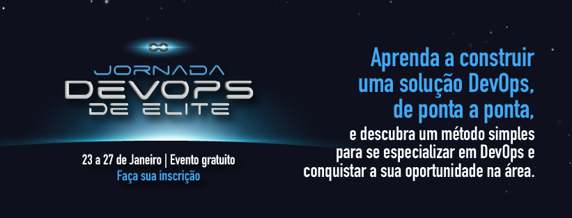

# Jornada DevOps de Elite

<!---Esses são exemplos. Veja https://shields.io para outras pessoas ou para personalizar este conjunto de escudos. Você pode querer incluir dependências, status do projeto e informações de licença aqui--->

> Projeto desenvolvido na 'Semana DevOps de Elite' com intuito de introduzir e mostrar todas as ferramentas do mercado nesta imersão da cultura DevOps
### 🏆 Desafios Concluídos

Abaixo estão os 5 desafios pedidos de cada aula.

- [x] Desafio 1 - Docker
- [x] Desafio 2 - Kubernetes 
- [x] Desafio 3 - Terraform
- [x] Desafio 4 - CI/CD com Jenkins
- [x] Desafio 5 - Monitoramento usando Prometheus e Grafana

## 🏆 Badges de cada desafio

 

